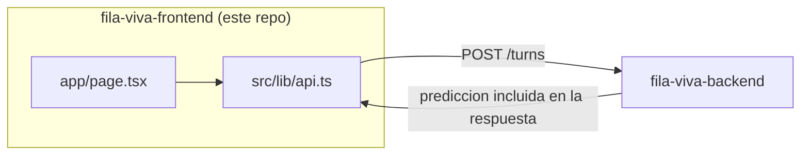

# Fila Viva — Frontend

Interfaz de **Fila Viva**, el sistema de predicción inteligente de tiempos de espera. Este repositorio es **uno de tres**:

| Repositorio | Qué hace | Estado |
|---|---|---|
| `fila-viva-backend` | API core: turnos, funcionarios, tipos de trámite, tiempo real | 🟡 Avance semana 3 |
| `fila-viva-frontend` (este) | PWA del ciudadano, pantalla de sala y panel de funcionarios | 🟡 Avance semana 3 |
| `fila-viva-ai` | Servicio de predicción (IA + teoría de colas) | 🟡 Avance semana 3 |


---

## 1. Qué es Fila Viva

Combina teoría de colas y machine learning para decirle a una persona, en tiempo real, cuánto va a esperar realmente (no solo su número de turno). El frontend es la cara visible de eso: la persona ve su turno, personas delante, tiempo estimado y confianza, y esa cifra se actualiza sola cuando algo cambia en la fila.

## 2. Estado del avance (semana 3 de 3)

**Hecho:**
- Proyecto Next.js 14 (App Router) + TypeScript.
- Cliente de API (`src/lib/api.ts`) que respeta exactamente el contrato de `fila-viva-backend` (`TurnResponse`).
- Una pantalla mínima (`app/page.tsx`) que permite tomar un turno de prueba y ver el resultado devuelto por el backend, incluida la predicción.
- Estilos base (`app/globals.css`) usando la misma paleta que la arquitectura de referencia del proyecto (fondo oscuro, acento ámbar para datos en vivo, teal para IA).

**Explícitamente NO hecho todavía:**
- No hay selección real de institución / tipo de trámite: los IDs de demo están hardcodeados hasta que exista una pantalla de configuración.
- No hay conexión WebSocket todavía (`socket.io-client` ya está en `package.json`, pero no se usa). La actualización de la predicción hoy requiere volver a tocar "Tomar un turno".
- No hay Web Worker para suavizar el conteo regresivo (etapa 7 del pipeline de IA, ver `fila-viva-backend/README.md`).
- No hay vista de pantalla de sala (kiosco) ni panel de funcionarios: solo existe la vista del ciudadano.
- No es todavía una PWA instalable (falta manifest y service worker).
- No hay manejo de roles ni autenticación.

## 3. Cómo encaja en la arquitectura completa



El frontend nunca le habla directamente a `fila-viva-ai`: siempre pasa por `fila-viva-backend`, que es quien orquesta la predicción y el estado de la cola. Ver `fila-viva-backend/README.md` para la arquitectura completa del sistema (las 7 capas, el pipeline de IA de 9 etapas y el flujo de recálculo en tiempo real).

## 4. Stack de este repositorio

| Pieza | Tecnología | Por qué |
|---|---|---|
| Framework | Next.js 14 (App Router) | Renderizado en servidor para la primera carga, estructura lista para separar vistas por rol más adelante. |
| Lenguaje | TypeScript | Mismo lenguaje que el backend; los tipos de `TurnResponse` deben coincidir entre ambos repos. |
| Tiempo real (pendiente de conectar) | socket.io-client | Debe conectarse al `TurnsGateway` de `fila-viva-backend`. |
| Estilos | CSS plano por ahora | Se migrará a TailwindCSS cuando se defina el sistema de diseño completo. |

## 5. Cómo correrlo localmente

Inicia primero `fila-viva-ai` y luego `fila-viva-backend`, cada uno desde su propia carpeta y con los comandos indicados en sus respectivos README. Confirma que el backend esté configurado con la URL/puerto donde escucha el servicio de IA y que ambos servicios estén activos antes de probar el flujo.

En PowerShell, desde cualquier carpeta, inicia el frontend así:

```powershell
cd "C:\Users\Acer\Desktop\PROYECTO 1\fila-viva-frontend"
$env:PORT = "3001"
npm run dev
```

Deja esa terminal abierta y visita <http://localhost:3001>. El puerto `3001` evita la colisión con el backend, que normalmente usa `3000`.

La primera vez, instala las dependencias desde la carpeta del frontend con `npm install`. Si el archivo `.env.local` aún no existe, créalo copiando `.env.local.example` y configura allí la URL del backend según las variables que use el proyecto.

## 6. Próximos pasos (backlog inmediato)

1. Pantalla de selección de institución y tipo de trámite (reemplaza los IDs hardcodeados).
2. Conexión WebSocket real: unirse a la sala de la cola (`joinQueue`) y escuchar `queueUpdate`.
3. Web Worker para interpolar el conteo regresivo entre actualizaciones del servidor.
4. Vista de "pantalla de sala" (modo kiosco) y panel de funcionarios, reutilizando el mismo cliente de API.
5. Manifest + service worker para que sea instalable como PWA.
6. Migrar los estilos a TailwindCSS.

## 7. Notas para una IA generadora de código

- **Todo el código va en inglés**; este `README.md` va en español.
- `src/lib/api.ts` define el contrato con el backend. Si el backend cambia su `TurnResponseDto`, actualizar esta interfaz primero.
- No dupliques lógica de predicción acá: cualquier cálculo de tiempos de espera vive en `fila-viva-ai` y se recibe ya resuelto desde `fila-viva-backend`.
- Los IDs de demo en `app/page.tsx` deben corresponder a registros existentes en el backend; reemplazarlos por una selección real es parte del paso 1 del backlog.
- Antes de agregar una librería de componentes UI, revisar si el equipo ya definió un sistema de diseño (ver si existe una nota al respecto en este README en una versión posterior).

## 8. Despliegue gratuito en Vercel

1. Importa el repositorio `fila-viva-frontend` en Vercel desde GitHub.
2. Vercel detectará Next.js automáticamente; deja los comandos de build y salida predeterminados.
3. Antes del despliegue, crea la variable de entorno `NEXT_PUBLIC_API_URL` con el valor `https://fila-viva-backend.onrender.com` para Production (y Preview si también vas a probar ramas).
4. Despliega y abre la URL asignada por Vercel. La primera llamada al backend puede tardar si el servicio gratuito de Render estaba suspendido por inactividad.

Este proyecto aún no tiene autenticación; úsalo solo para demos con los datos ficticios de esta guía.
